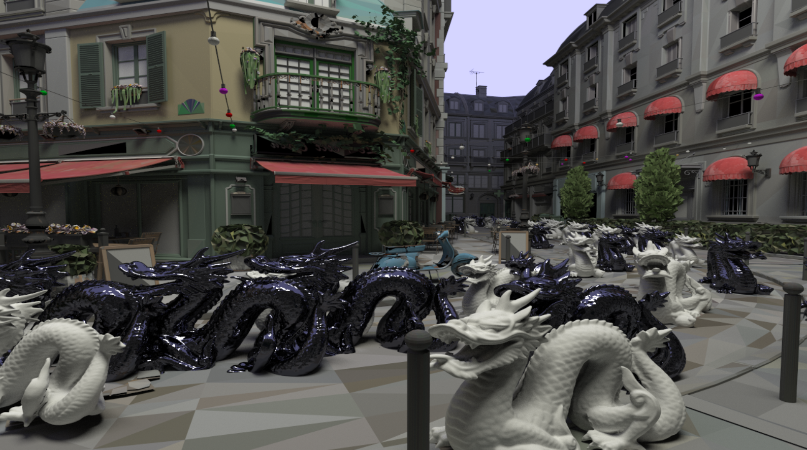
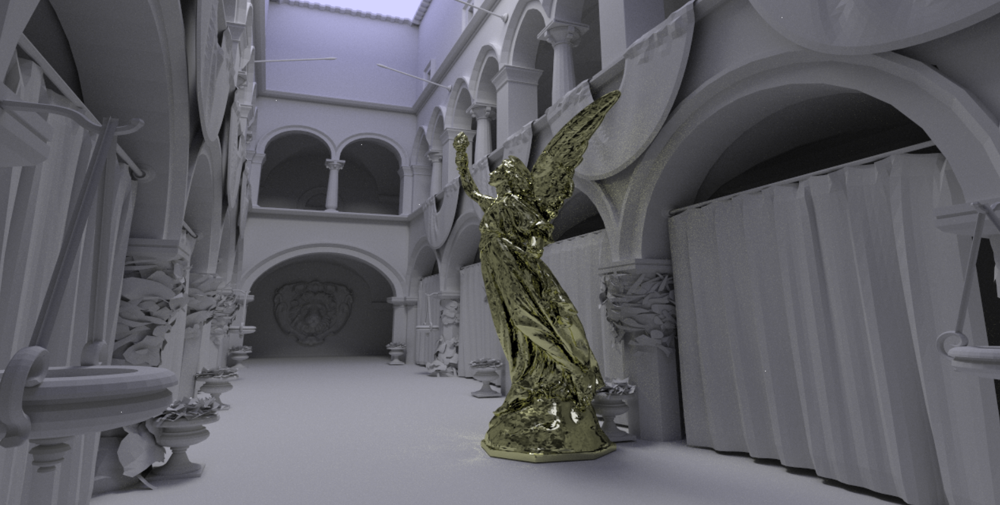
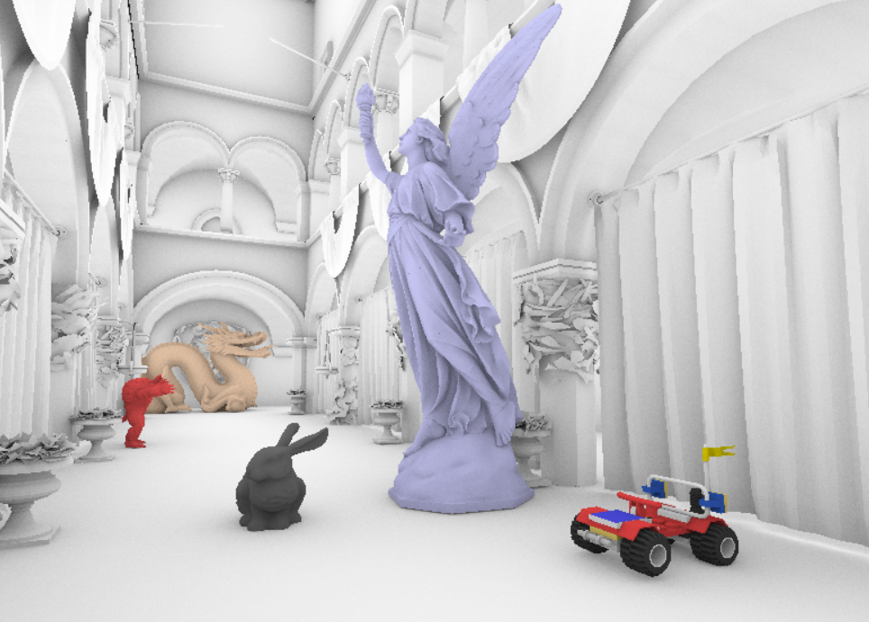

# tinybvh
Single-header BVH construction and traversal library written as "Sane C++" (or "C with classes"). Some C++11 is used, e.g. for threading. The library has no dependencies. 

# tinyocl
Single-header OpenCL library, which helps you select and initialize a device. It also loads, compiles and runs kernels, with several convenient features:
* Include-file expansion for AMD devices
* Multi-argument passing
* Host/device buffer management
* Vendor and architecture detection and propagation to #defines in OpenCL code
* ..And many other things.



To use tinyocl, just include ````tiny_ocl.h````; this will automatically cause linking with ````OpenCL.lib```` in the 'external' folder, which in turn passes on work to vendor-specific driver code. But all that is not your problem!

Note that the ````tiny_bvh.h```` library will work without ````tiny_ocl.h```` and remains dependency-free. The new ````tiny_ocl.h```` is only needed in projects that wish to trace rays _on the GPU_ using BVHs created by ````tiny_bvh.h````. 
  
# BVH?
A Bounding Volume Hierarchy is a data structure used to quickly find intersections in a virtual scene; most commonly between a ray and a group of triangles. You can read more about this in a series of articles on the subject: https://jacco.ompf2.com/2022/04/13/how-to-build-a-bvh-part-1-basics .

Right now tiny_bvh comes with the following builders:
* ````BVH::Build```` : Efficient plain-C/C+ binned SAH BVH builder which should run on any platform.
* ````BVH::BuildAVX```` : A highly optimized version of BVH::Build for Intel CPUs.
* ````BVH::BuildNEON```` : An optimized version of BVH::Build for ARM/NEON.
* ````BVH::BuildHQ```` : A 'spatial splits' BVH builder, for highest BVH quality.

Several special-purpose builders are also available:
* ````BVH::BuildQuick```` : Simple mid-point split BVH builder. For reference only.
* ````BVH::BuildEx```` : Double-precision version of ````BVH::Build````. Takes ````bvhdbl3```` vertices as input.
* ````BVH::BuildTLAS```` : Builds a BVH over an array of ````bvhaabb````s or ````BVHInstance````s.

A constructed BVH can be used to quickly intersect a ray with the geometry, using ````BVH::Intersect```` or ````BVH::IsOccluded````, for shadow rays. The double-precision BVH is traversed using ````BVH::IntersectEx````.

Apart from the default BVH layout (simply named ````BVH````), several other layouts are available, which all serve one or more specific purposes. You can create a BVH in the desired layout by instantiating the appropriate class, or by converting from ````BVH```` using the ````::ConvertFrom```` methods. The available layouts are:
* ````BVH```` : A compact format that stores the AABB for a node, along with child pointers and leaf information in a cross-platform-friendly way. The 32-byte size allows for cache-line alignment.
* ````BVH_SoA```` : This format stores bounding box information in a SIMD-friendly format, making the BVH faster to traverse.
* ````BVH_Double```` : Double-precision version of ````BVH````.
* ````BVH_Verbose```` : A format designed for modifying BVHs, e.g. for post-build optimizations using ````BVH_Verbose::Optimize()````.
* ````BVH_GPU```` : This format uses 64 bytes per node and stores the AABBs of the two child nodes. This is the format presented in the [2009 Aila & Laine paper](https://research.nvidia.com/sites/default/files/pubs/2009-08_Understanding-the-Efficiency/aila2009hpg_paper.pdf). It can be traversed with a simple GPU kernel.
* ````MBVH<M>```` : In this (templated) format, each node stores M child pointers, reducing the depth of the tree. This improves performance for divergent rays. Based on the [2008 paper](https://graphics.stanford.edu/~boulos/papers/multi_rt08.pdf) by Ingo Wald et al.
* ````BVH4_GPU```` : A more compact version of the ````BVH4```` format, which will be faster for GPU ray tracing.
* ````BVH4_CPU```` : A SIMD-friendly version of the ````BVH4```` format, currently the fastest option for single-ray traversal on CPU.
* ````BVH8_CWBVH```` : An advanced 80-byte representation of the 8-wide BVH, for state-of-the-art GPU rendering, based on the [2017 paper](https://research.nvidia.com/publication/2017-07_efficient-incoherent-ray-traversal-gpus-through-compressed-wide-bvhs) by Ylitie et al. and [code by AlanWBFT](https://github.com/AlanIWBFT/CWBVH).

A BVH in the ````BVH```` format may be _refitted_, in case the triangles moved, using ````BVH::Refit````. Refitting is substantially faster than rebuilding and works well if the animation is subtle. Refitting does not work if polygon counts change.

New in version 1.1.3: 'Self-contained' formats may be serialized and de-serialized via ````::Save```` and ````::Load````. Currently this is supported for ````BVH8_CWBVH````, which stores vertex data in a custom format and thus does not rely on the input vertices for traversal.

# How To Use
The library ````tiny_bvh.h```` is designed to be easy to use. Please have a look at tiny_bvh_minimal.cpp for an example. A Visual Studio 'solution' (.sln/.vcxproj) is included, as well as a CMake file. That being said: The examples consists of only a single source file, which can be compiled with clang or g++, e.g.:

````g++ -std=c++20 -mavx tiny_bvh_minimal.cpp -o tiny_bvh_minimal````

The single-source sample **ASCII test renderer** can be compiled with

````g++ -std=c++20 -mavx tiny_bvh_renderer.cpp -o tiny_bvh_renderer````

The cross-platform fenster-based single-source **bitmap renderer** can be compiled with

````g++ -std=c++20 -mavx -mwindows -O3 tiny_bvh_fenster.cpp -o tiny_bvh_fenster```` (on windows)

```g++ -std=c++20 -mavx -O3 -framework Cocoa tiny_bvh_fenster.cpp -o tiny_bvh_fenster``` (on macOS)

The multi-threaded **path tracing** demo can be compiled with

````g++ -std=c++20 -mavx -mwindows -O3 tiny_bvh_pt.cpp -o tiny_bvh_pt```` (on windows)

The **performance measurement tool** can be compiled with:

````g++ -std=c++20 -mavx -Ofast tiny_bvh_speedtest.cpp -o tiny_bvh_speedtest````

# Version 1.2.5

Version 1.1.0 introduced a <ins>change to the API</ins>. The single BVH class with multiple layouts has been replaced with a BVH class per layout. You can simply instantiate the desired layout; conversion (and data ownership) is then handled properly by the library. Examples:

````
BVH bvh;
bvh.Build( (bvhvec4*)myTriData, triangleCount ); // or: BuildHQ( .. )
bvh.Intersect( ray );
````

````
BVH4_CPU bvh;
bvh.Build( (bvhvec4*)myTriData, triangleCount );
bvh.Intersect( ray );
````

To build a BVH for indexed vertices, use the new indexed interface:

````
BVH bvh;
bvh.Build( (bvhvec4*)vertices, (uint32_t*)indices, triangleCount );
````

If you wish to use a specific builder (such as the spatial splits builder) or if you need to do custom operations on the BVH, such as post-build optimizing, you can still do the conversions manually. Example:

````
BVH bvh;
bvh.BuildHQ( verts, indices, triCount );
BVH_Verbose tmp;
tmp.ConvertFrom( bvh );
tmp.Optimize( 100000 );
bvh.ConvertFrom( tmp );
printf( "Optimized BVH SAH cost: %f\n", bvh.SAHCost() );
````

Note that in this case, data ownership and lifetime must be managed carefully. Specifically, layouts converted from other layouts use data from the original, so both must be kept alive.

This version of the library includes the following functionality:
* Binned SAH BVH builder
* Fast binned SAH BVH builder using AVX intrinsics
* Fast binned SAH BVH builder using NEON intrinsices, by [wuyakuma](https://github.com/wuyakuma)
* TLAS builder with instancing and TLAS/BLAS traversal
* Double-precision binned SAH BVH builder
* Example code for GPU TLAS/BLAS traversal (dragon invasion demo, tiny_bvh_gpu2.cpp)
* Spatial Splits ([SBVH](https://www.nvidia.in/docs/IO/77714/sbvh.pdf), Stich et al., 2009) builder, including "unsplitting"
* 'Compressed Wide BVH' (CWBVH) data structure
* BVH optimizer: reduces SAH cost and improves ray tracing performance ([Bittner et al., 2013](https://dspace.cvut.cz/bitstream/handle/10467/15603/2013-Fast-Insertion-Based-Optimization-of-Bounding-Volume-Hierarchies.pdf))
* Collapse to N-wide MBVH using templated code
* Conversion of 4-wide BVH to GPU-friendly 64-byte quantized format
* Single-ray and packet traversal
* Fast triangle intersection: Implements the 2016 paper by [Baldwin & Weber](https://jcgt.org/published/0005/03/03/paper.pdf)
* OpenCL traversal: Aila & Laine, 4-way quantized, CWBVH
* Support for WASM / EMSCRIPTEN, g++, clang, Visual Studio
* Optional user-defined memory allocation, by [Thierry Cantenot](https://github.com/tcantenot)
* Vertex array can now have a custom stride, by [David Peicho](https://github.com/DavidPeicho)
* Vertex array can now be indexed
* Custom primitives can be intersected via callbacks (new in 1.2.2)
* Clear data ownership and intuitive management via the new and simplified API, with lots of help from David Peicho
* You can now also BYOVT ('bring your own vector types'), thanks [Tijmen Verhoef](https://github.com/nemjit001)
* 'SpeedTest' tool that times and validates all (well, most) traversal kernels.

The current version of the library is rapidly gaining functionality. Please expect changes to the interface.

Plans, ordered by priority:

* NEW: We now also use the "Issues" list for this!
* TLAS/BLAS traversal with BLAS transforms
  * Support more than two levels
* Documentation:
  * Wiki
  * Article on architecture and intended use
* Bridge to rt hw / layouts:
  * Produce a BVH for Intel rt hw (mind the quads)
  * Produce a BVH for AMD rt hw
  * Use inline asm on AMD for aabb/tri intersect
  * Support templated N-wide BVH
* Example renderers:
  * CPU WHitted-style ray tracer
  * CPU and GPU path tracer
  * CPU and GPU wavefront path tracer
* BVH::Optimize:
  * Faster Optimize algorithm (complete paper implementation)
  * Understanding optimized SBVH performance
* CPU single-ray performance
  * Reverse-engineer Embree & PhysX
  * Implement Fuetterling et al.'s 2017 paper
  
# tinybvh in the Wild
A list of projects using tinybvh:
* [unity-tinybvh](https://github.com/andr3wmac/unity-tinybvh): An example implementation for tinybvh in Unity and a foundation for building compute based raytracing solutions, by Andrew MacIntyre.
* [TrenchBroomBFG](https://github.com/RobertBeckebans/TrenchBroomBFG), by Robert Beckebans. "TinyBVH allows to load bigger glTF 2 maps almost instantly instead of minutes". 

# tinybvh Rust bindings
The tinybvh library can now also be used from Rust, with the [Rust bindings](https://docs.rs/tinybvh-rs/latest/tinybvh_rs) provided by David Peicho.

Created or know about other projects? [Let me know](mailto:bikker.j@gmail.com)!

# Contact
Questions, remarks? Contact me at bikker.j@gmail.com or on twitter: @j_bikker, or BlueSky: @jbikker.bsky.social .

# License
This library is made available under the MIT license, which starts as follows: "Permission is hereby granted, free of charge, .. , to deal in the Software **without restriction**". Enjoy.





